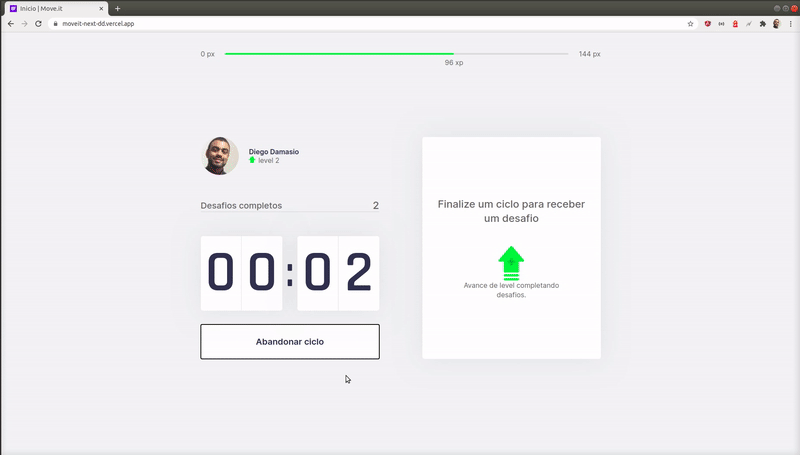

# GitHub Explorer

## What's it?
This is a health app project to helps people to take breaks while working. This was built with TypeScript, NextJS and ReactJS.

## Sample

## Requirements:
1. `node 12.14.0 or >`

## Running the project (locally):

1. `cd moveitNext`
2. `yarn`
3. `yarn dev`

## Live demo:
1. `https://moveit-next-dd.vercel.app`